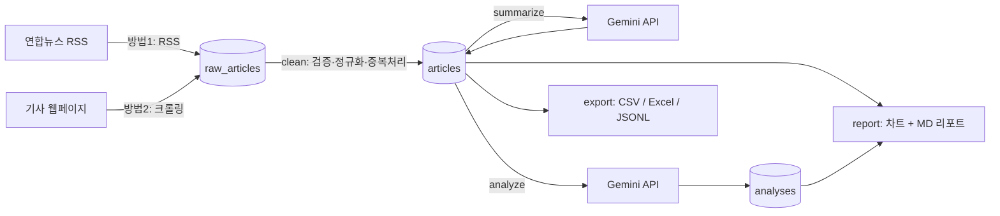
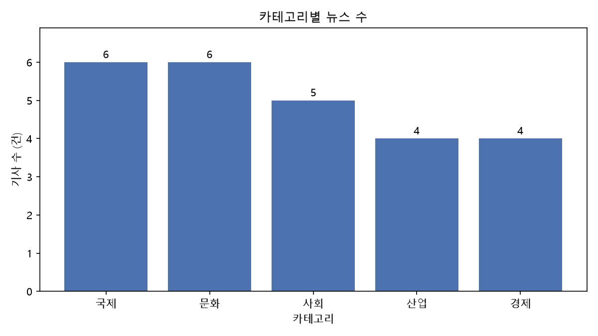
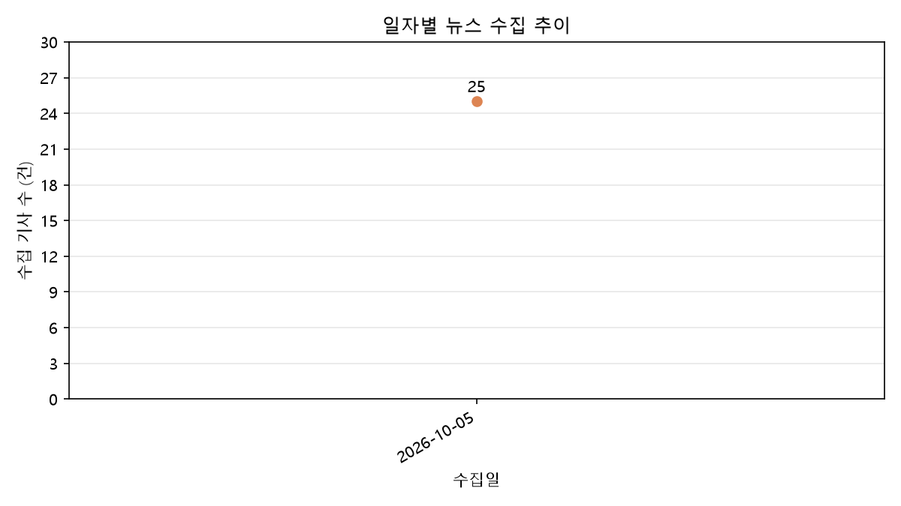
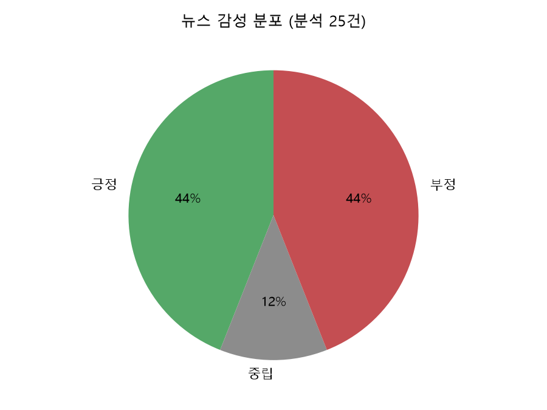

# 📰 AI 뉴스 트렌드 및 종합 분석 리포트 CLI

뉴스를 **자동 수집 → 정제 → AI 요약 → AI 인사이트 분석 → 시각화·리포트 → 내보내기**까지
하나로 연결한 CLI 기반 데이터 파이프라인입니다.



## 목차
1. [기능](#1-기능) · 2. [폴더 구조](#2-폴더-구조) · 3. [설치](#3-설치) · 4. [설정](#4-설정) ·
5. [사용법](#5-사용법) · 6. [데이터 저장 구조](#6-데이터-저장-구조) · 7. [설계 설명](#7-설계-설명) ·
8. [정기 실행](#8-정기-실행-스케줄링-보너스) · 9. [트러블슈팅](#9-트러블슈팅) · 10. [실행 결과](#10-실행-결과) · 11. [한계와 개선 방향](#11-한계와-개선-방향)

---

## 1. 기능

| 명령 | 설명 | 주요 옵션 |
|---|---|---|
| `fetch` | RSS(방법1)로 기사 목록을, 크롤링(방법2)으로 본문을 수집해 raw 저장 | `--source` `--category` `--limit` `--no-crawl` |
| `clean` | raw → clean 정제 (필수 필드 검증, 텍스트 정규화, 날짜 통일, 결측값, 중복) | `--policy skip\|upsert` `--reprocess` |
| `summarize` | Gemini API 로 기사 요약 | `--all` `--id` `--unsummarized` `--force` `--limit` `--sentences` |
| `analyze` | 기간·카테고리별 종합 분석 (트렌드, 키워드, 공통점, 차이점, 시사점) | `--date-from` `--date-to` `--category` `--show` `--list` |
| `report` | 차트(PNG) + 품질 지표 + TOP N + AI 인사이트 리포트 (콘솔 + MD/TXT) | `--top` `--format md\|txt` `--category` |
| `export` | CSV / Excel / JSONL 내보내기 | `--format` `--status summarized` `--category` |
| `list` ⭐ | 뉴스 목록 조회 (필터 + 페이지네이션) | `--category` `--date` `--keyword` `--page` `--size` |
| `show` ⭐ | 뉴스 상세 조회 | `ID` `--full` |
| `sentiment` ⭐ | AI 감성 분석 (긍정/부정/중립), 리포트에 분포 차트 추가 | `--all` `--id` `--batch` |

⭐ 보너스 과제

## 2. 폴더 구조

```
news-insight-pipeline/
├── main.py                 # CLI 진입점 (argparse 서브커맨드)
├── config.json             # 설정 (소스 URL, 중복 정책, AI 모델 등) - API 키 없음
├── .env.example            # API 키 예시 (.env 로 복사해서 사용, Git 제외)
├── requirements.txt
├── pipeline/
│   ├── config.py           # 설정·환경변수 로드, API 키 형식 검증
│   ├── logger.py           # logging 설정 (콘솔 + logs/app.log)
│   ├── storage.py          # SQLite 저장소 (raw / clean / analyses)
│   ├── collector.py        # fetch: RSS + 크롤링, 타임아웃·재시도·robots.txt·요청 지연
│   ├── cleaner.py          # clean: 정제 규칙, 중복 정책
│   ├── ai_client.py        # Gemini REST 호출, 재시도, 대체 모델 전환
│   ├── summarizer.py       # summarize
│   ├── analyzer.py         # analyze
│   ├── visualizer.py       # matplotlib 차트 (한글 폰트)
│   ├── reporter.py         # report
│   ├── exporter.py         # export
│   ├── browser.py          # list / show (보너스)
│   └── sentiment.py        # sentiment (보너스)
├── scripts/
│   ├── daily_run.bat       # Windows 작업 스케줄러용
│   └── daily_run.sh        # Linux/macOS cron 용
└── docs/                   # 실행 결과 샘플 (리포트, 차트)
```

실행 중 생성되는 `data/`(DB), `logs/`, `output/` 은 `.gitignore` 로 제외됩니다.

## 3. 설치

Python 3.10 이상이 필요합니다.

```bash
git clone https://github.com/17lucky71/news-insight-pipeline.git
cd news-insight-pipeline
python -m venv venv
venv\Scripts\activate          # macOS/Linux: source venv/bin/activate
pip install -r requirements.txt
```

## 4. 설정

### API 키 (.env)

API 키는 **코드나 config.json 에 쓰지 않고** `.env` 파일(환경변수)로만 관리합니다.

1. [Google AI Studio](https://aistudio.google.com/apikey) 에서 Gemini API 키 발급
2. `.env.example` 을 `.env` 로 복사하고 키 입력

```
GEMINI_API_KEY=발급받은_키
```

### config.json 주요 항목

| 항목 | 설명 | 기본값 |
|---|---|---|
| `default_source`, `sources` | 뉴스 소스, 카테고리별 RSS URL, 본문 CSS 선택자 | 연합뉴스 5개 카테고리 |
| `duplicate_policy` | 중복 기사 처리: `skip`(건너뜀) / `upsert`(덮어씀) | `skip` |
| `http.timeout` / `max_retries` / `request_delay` | 요청 타임아웃(초), 재시도 횟수, 요청 간 지연(초) | 10 / 2 / 1.0 |
| `ai.model` / `fallback_models` | 기본 모델과 대체 모델 목록 | `gemini-2.5-flash` → `flash-lite` → `flash-latest` |
| `ai.request_delay` | AI 호출 간 최소 간격(초), 무료 요금제 분당 한도 대응 | 4.0 |
| `ai.max_input_chars` / `max_analysis_chars` | 요약·분석에 보내는 최대 글자 수 (토큰 절약) | 4000 / 30000 |
| `output.*` | 리포트·차트·내보내기 저장 폴더 | `output/...` |

## 5. 사용법

```bash
# 1) 수집: 전체 카테고리에서 30건 (RSS + 본문 크롤링)
python main.py fetch --limit 30
python main.py fetch --category 경제 --limit 10

# 2) 정제
python main.py clean
python main.py clean --policy upsert          # 중복 기사를 덮어쓰기
python main.py clean --reprocess              # 정제 규칙 변경 후 raw 에서 전부 재정제

# 3) AI 요약
python main.py summarize --unsummarized --limit 10
python main.py summarize --id 3 5 --force     # 특정 기사 재요약

# 4) AI 인사이트 분석
python main.py analyze --date-from 2026-10-01 --date-to 2026-10-05 --category 경제
python main.py analyze --list                 # 저장된 분석 목록
python main.py analyze --show                 # 최신 분석 결과 다시 보기

# 5) 리포트 (콘솔 출력 + output/reports 저장, 차트는 output/charts)
python main.py report --top 5
python main.py report --format txt

# 6) 내보내기
python main.py export --format csv --status summarized
python main.py export --format excel
python main.py export --format jsonl --category 국제

# 보너스
python main.py list --category 사회 --keyword AI --page 2 --size 10
python main.py show 12 --full
python main.py sentiment --batch 10
```

### 실행 예시

```
$ python main.py fetch --limit 5
[INFO] 뉴스 수집 시작: source=yonhap, category=전체, limit=5
[INFO] RSS [경제] 1건 수신
...
[INFO] [1/5] 크롤링 완료 (733자): 문체부·행안부, 지역관광 경진대회에 61억원 재정 인센
[INFO] 수집 완료: RSS 5건 / 크롤링 5건 성공, 0건 실패, 0건 기존 수집분 스킵
[INFO] raw 저장소에 저장 완료 (누적 raw 10건)

$ python main.py summarize --unsummarized --limit 3
[INFO] 요약 대상: 3건 (모델: gemini-2.5-flash)
[INFO] [1/3] ID=4 요약 완료 (356자 → 142자)
...
```

### 예상 소요 시간

| 명령 | 기준 | 비고 |
|---|---|---|
| `fetch` | 기사 1건당 약 1~2초 | RSS 요청 + 본문 요청, 요청 간 1초 지연 (`http.request_delay`) |
| `clean` | 100건 기준 1초 이내 | 로컬 처리만 수행 |
| `summarize` | 기사 1건당 약 4~8초 | 무료 한도 대응 4초 간격 (`ai.request_delay`) + 응답 시간 |
| `analyze` | 요청 1회, 약 10~30초 | 기사 수십 건을 한 번에 분석 |
| `sentiment` | 10건당 요청 1회 | `--batch` 로 묶음 크기 조절 |
| `report` / `export` | 수 초 이내 | 로컬 처리만 수행 |

## 6. 데이터 저장 구조

SQLite(`data/news.db`) 영구 저장소를 사용합니다.

| 테이블 | 역할 | 주요 컬럼 |
|---|---|---|
| `raw_articles` | 수집 원본 그대로 | `source`, `method`(rss/crawl), `url`, `payload`(JSON), `fetched_at`, `processed` |
| `articles` | 정제된 기사 + AI 결과 | `url`(UNIQUE), `title`, `content`, `category`, `published_at`, `summary`, `sentiment`, `status` |
| `analyses` | AI 인사이트 분석 결과 | `date_from`, `date_to`, `category`, `article_count`, `result`(JSON), `model` |

### 수집 데이터 예시 (raw_articles.payload)

같은 기사 URL 에 대해 RSS 와 크롤링 결과가 각각 저장됩니다. (기사 내용은 예시용으로 줄여서 표기)

```jsonc
// method = "rss" : RSS 피드 항목에서 얻는 메타데이터
{
  "title": "○○부, 지역관광 경진대회 개최",
  "link": "https://www.yna.co.kr/view/AKR2026100500000000",
  "description": "○○부는 지역관광 혁신 아이디어 경진대회를...",
  "published": "Mon, 05 Oct 2026 03:41:22 +0000",   // RFC 822 형식
  "author": "홍길동",
  "category": "경제",
  "feed_url": "https://www.yna.co.kr/rss/economy.xml"
}

// method = "crawl" : 기사 페이지를 BeautifulSoup 으로 파싱한 결과
{
  "url": "https://www.yna.co.kr/view/AKR2026100500000000",
  "title": "○○부, 지역관광 경진대회 개최",
  "body": "[OO 제공. 재판매 및 DB 금지]\n(서울=연합뉴스) 홍길동 기자 = ○○부는 ...\nhong@yna.co.kr\n제보는 카카오톡 okjebo <저작권자(c) 연합뉴스, 무단 전재-재배포...>",
  "published": "2026-10-05T12:41:22+09:00",          // ISO 8601 형식
  "description": "...",
  "category": "경제"
}
```

### 정제 전후 비교 (clean)

| 항목 | raw (정제 전) | clean (정제 후) |
|---|---|---|
| 본문 첫 줄 | `[OO 제공. 재판매 및 DB 금지]` 사진 출처 | 제거 |
| 본문 머리말 | `(서울=연합뉴스) 홍길동 기자 = ○○부는 ...` | `○○부는 ...` |
| 본문 끝 | 기자 이메일, 제보 안내, 저작권 문구, 송고 시각 | 제거 |
| 발행일 | `Mon, 05 Oct 2026 03:41:22 +0000` / `2026-10-05T12:41:22+09:00` | `2026-10-05 12:41:22` (KST 통일) |
| 수집 방법 | `rss`, `crawl` 2건 | `rss+crawl` 1건으로 병합 |

```
$ python main.py clean
[INFO] 정제 시작: raw 10건 → 기사 5건, 중복 정책=skip
[INFO] 정제 완료: 신규 5건, 갱신 0건, 중복 스킵 0건, 검증 실패 0건

$ python main.py clean            # 같은 raw 를 다시 실행하면
[INFO] 정제할 새 raw 데이터가 없습니다. 먼저 fetch 를 실행하세요.

$ python main.py clean --reprocess  # 정제 규칙 수정 후 원본에서 재정제
[INFO] 재정제 모드: raw 10건을 다시 정제합니다 (중복 정책=upsert 로 기존 기사 갱신)
[INFO] 정제 완료: 신규 0건, 갱신 5건, 중복 스킵 0건, 검증 실패 0건
```

raw 데이터는 재정제를 위해 삭제하지 않고 보관합니다. 운영 환경이라면 일정 기간(예: 90일)이 지난
처리 완료(processed=1) raw 를 별도 파일로 백업한 뒤 정리하는 보관 정책을 둘 수 있습니다.

## 7. 설계 설명

### 모듈별 입력과 출력

| 모듈 | 입력 | 출력 |
|---|---|---|
| `collector` | config 의 RSS URL, 기사 URL | `raw_articles` 행 (rss / crawl) |
| `cleaner` | 처리 안 된 `raw_articles` | `articles` 행 (status=cleaned) |
| `summarizer` | `articles` (status=cleaned) | `articles.summary` (status=summarized) |
| `analyzer` | 조건에 맞는 `articles` | `analyses` 행 (JSON 결과) |
| `sentiment` | `articles` | `articles.sentiment` |
| `visualizer` / `reporter` | `articles`, 최신 `analyses` | PNG 차트, MD/TXT 리포트 |
| `exporter` | 조건에 맞는 `articles` | CSV / XLSX / JSONL 파일 |
| `ai_client` | 프롬프트 | AI 응답 텍스트 (재시도·모델 전환 포함) |
| `storage` | 모든 모듈의 읽기/쓰기 요청 | SQLite (`data/news.db`) |

모든 단계가 DB 를 통해 데이터를 주고받기 때문에 각 명령을 독립적으로, 원하는 시점에 다시 실행할 수 있습니다.

### API/RSS 방식 vs 크롤링 방식

| | RSS / API | 크롤링 |
|---|---|---|
| 장점 | 구조화된 데이터(제목·링크·날짜), 사이트 개편에 강함, 서버 부담 적음, 제공자가 허용한 공식 경로 | 본문 전체 등 RSS 에 없는 정보까지 수집 가능 |
| 단점 | 제공 항목이 제한적(본문 없이 요약만 오는 경우가 많음), 최신 N건만 제공 | HTML 구조가 바뀌면 선택자 수정 필요, 사이트 정책·요청량에 주의 필요 |

이 프로젝트는 두 방식의 장점을 합쳐 **RSS 로 목록과 메타데이터**를 받고 **크롤링으로 본문**을 보강합니다.
크롤링에 실패하면 RSS 요약을 본문 대신 사용합니다(결측값 처리).

### 오류 처리

| 상황 | 처리 |
|---|---|
| 타임아웃, 연결 실패, 5xx | 최대 2회 재시도. AI 호출은 10초·20초로 점점 길게 대기 |
| 4xx (404 등) | 재시도해도 결과가 같으므로 즉시 실패 처리 후 다음 항목 진행 |
| RSS 형식 오류 / 본문 선택자 불일치 | 경고 로그 후 해당 항목만 건너뜀 |
| AI 분당 한도(429) | 대기 후 재시도 |
| AI 일일 한도(429 PerDay), 모델 없음(404), 지속적 과부하(503) | `fallback_models` 의 다음 모델로 자동 전환, 모두 소진되면 중단하고 이어서 실행 안내 |
| API 키 누락·형식 오류 | 호출 전에 검증해 명확한 메시지로 안내 |
| 크롤링 실패율 50% 이상 | 사이트 구조 변경을 의심하고 선택자 확인을 안내하는 경고 출력 |

개발 중 실제로 발생한 로그 예시입니다.

```
# 분당 한도 초과 → 대기 후 재시도
[WARNING] AI 호출 실패 (HTTP 429: Resource exhausted ...) [1/3], 10초 후 재시도

# 일일 한도 소진 → 재시도 없이 대체 모델로 전환
[WARNING] 모델 gemini-2.5-flash 의 일일 한도가 소진되어 gemini-2.5-flash-lite 로 전환합니다.

# 서버 과부하가 계속됨 → 재시도 후 대체 모델로 전환
[WARNING] AI 호출 실패 (HTTP 503: This model is currently experiencing high demand ...) [3/3]
[WARNING] 모델 gemini-2.5-flash 가 계속 응답하지 않아(...) gemini-2.5-flash-lite 로 전환합니다.

# 모든 모델 소진 → 즉시 중단하고 이어서 실행할 방법 안내
[ERROR] 모든 모델의 일일 무료 한도를 다 썼습니다 (마지막 시도: gemini-flash-latest)
[WARNING] 남은 5건은 한도가 초기화된 뒤 'summarize --unsummarized' 로 이어서 요약하세요.
```

### raw / clean 분리 이유

- **raw** 는 수집한 원본을 가공 없이 보관하는 단계, **clean** 은 분석에 바로 쓸 수 있게 검증·정규화한 단계입니다.
- 정제 규칙에 문제가 있어도 원본이 남아 있어 **다시 수집하지 않고 재정제**할 수 있습니다.
  실제로 개발 중 연합뉴스 본문에 섞인 사진 출처 표기(`[연합뉴스TV 제공]`, `[EPA=연합뉴스 자료사진]`)를 발견해
  규칙을 추가한 뒤 `clean --reprocess` 로 기존 기사를 모두 갱신했습니다.
- 원본과 결과를 비교해 정제 과정을 검증(디버깅)할 수 있고, 수집과 정제를 독립적으로 실행할 수 있습니다.

정제 규칙: 필수 필드(URL·제목·본문) 검증 / HTML 엔티티·태그 제거, 유니코드 정규화, 공백 정리 /
사진 설명·기자 머리말·이메일·저작권 문구 제거 / RFC 822·ISO 8601 날짜를 `YYYY-MM-DD HH:MM:SS`(KST)로 통일 /
결측값 대체(본문→RSS 요약, 발행일→수집 시각, 카테고리→'미분류') / URL 추적 파라미터 제거 후 중복 판단.

### AI API 호출 흐름

1. DB 에서 대상 기사 선택 (이미 요약된 기사는 기본 스킵)
2. 프롬프트 구성: 역할(system) + 지시사항 + 기사 제목·본문 (최대 글자 수 제한)
3. `requests.post` 로 Gemini `generateContent` REST API 호출 (API 키는 URL 이 아닌 헤더로 전송)
4. 응답 JSON 에서 텍스트 추출, 분석·감성은 JSON 모드로 받아 파싱
5. 결과를 DB 에 저장, 실패한 기사는 로그만 남기고 다음 기사 진행

### 집계와 시각화

SQL/`Counter` 로 카테고리별·일자별 기사 수를 집계하고 matplotlib 으로 막대·선(·원) 그래프를 그립니다.
운영체제에 맞는 한글 폰트(맑은 고딕, AppleGothic, 나눔고딕 등)를 자동으로 찾아 적용하고 PNG 로 저장합니다.

리포트 구성: **품질 지표 5개**(정제 통과율, 본문 크롤링 성공률, AI 요약 완료율, 평균 본문 길이, 요약 압축률) /
**TOP N 2종**(카테고리별 기사 수, 제목 키워드 빈도) / **AI 인사이트** / **차트**.

### 동적 페이지 대응

이 프로젝트의 수집 대상(연합뉴스 기사 페이지)은 본문이 HTML 에 바로 들어 있어 `requests` + BeautifulSoup 으로 충분합니다.
JavaScript 가 실행된 뒤에야 본문이 그려지는 사이트라면 HTML 에 본문이 없으므로,
Selenium 이나 Playwright 같은 **헤드리스 브라우저**로 페이지를 실제로 렌더링한 뒤 파싱해야 합니다.
다만 브라우저 실행은 느리고 자원을 많이 쓰므로, 먼저 사이트가 내부적으로 호출하는 JSON API 가 있는지 확인하는 것이 좋습니다.

### 크롤링 윤리 및 요청 제한

- 크롤링 전 `robots.txt` 를 확인해 금지된 경로는 수집하지 않습니다.
- 모든 요청 사이에 1초 이상 간격을 두고, 수집 건수를 `--limit` 으로 제한합니다.
- 이미 크롤링한 기사는 다시 요청하지 않습니다.
- 수집한 기사는 학습 목적으로만 사용하며 저작권은 원 언론사에 있습니다.

## 8. 정기 실행 (스케줄링) ⭐

`scripts/` 의 스크립트가 **수집 → 정제 → 요약 → 감성 분석 → 리포트**를 순서대로 실행합니다.

### Windows 작업 스케줄러

명령 프롬프트에서 매일 오전 8시 실행 등록:

```bat
schtasks /create /tn "NewsInsightDaily" /tr "C:\Users\사용자\news-insight-pipeline\scripts\daily_run.bat" /sc daily /st 08:00
```

확인 `schtasks /query /tn "NewsInsightDaily"` · 삭제 `schtasks /delete /tn "NewsInsightDaily" /f`

(GUI: 작업 스케줄러 → 기본 작업 만들기 → 매일 → 프로그램 시작 → `daily_run.bat` 선택)

### Linux / macOS cron

```bash
chmod +x scripts/daily_run.sh
crontab -e
```

```cron
# 매일 오전 8시 실행, 출력은 로그 파일에 추가
0 8 * * * /home/사용자/news-insight-pipeline/scripts/daily_run.sh >> /home/사용자/news-insight-pipeline/logs/cron.log 2>&1
```

무료 AI 한도를 고려해 스크립트에서 요약은 하루 20건으로 제한했고, 한도가 차면 다음 실행 때 `--unsummarized` 로 이어집니다.

## 9. 트러블슈팅

개발 중 실제로 겪은 문제와 해결 방법입니다.

| 증상 | 원인 | 해결 |
|---|---|---|
| `API 키 형식이 아닙니다` | `.env` 에 예시 문구가 그대로 있거나 키 일부만 복사됨 | `.env` 의 키를 다시 복사해 저장 |
| `HTTP 429 ... exceeded your current quota` | 해당 모델의 **일일** 무료 한도 소진 | 자동으로 대체 모델 전환. 모두 소진 시 다음 날 이어서 실행 |
| `HTTP 503 ... high demand` | Gemini 서버 일시 과부하 | 재시도 후 대체 모델로 전환. 잠시 후 재실행 |
| 차트 한글이 □ 로 깨짐 | 한글 폰트 미설치 | Windows 는 기본 지원, Linux 는 `sudo apt install fonts-nanum` 후 재실행 |
| `본문을 찾지 못했습니다` | 사이트 HTML 구조 변경 | `config.json` 의 `article_selectors` 수정 |

## 10. 실행 결과

`docs/` 폴더에 실제 실행 결과를 첨부했습니다.

- [샘플 리포트](docs/sample_report.md)
- 카테고리별 뉴스 수 
- 일자별 수집 추이 
- 감성 분포 (보너스) 

결과 샘플은 `python main.py report` 후 `python scripts/update_docs.py` 로 갱신합니다.

## 11. 한계와 개선 방향

- **중복 판단**: 현재는 URL 기준입니다. 같은 사건을 다룬 다른 URL 기사까지 묶으려면 제목·본문 유사도(예: TF-IDF 코사인 유사도) 기반 중복 판단을 추가할 수 있습니다.
- **모니터링**: 크롤링 실패율·요약 실패율을 로그로 남기고 있으며, 운영 환경이라면 임계값을 넘을 때 메일·슬랙으로 알리도록 확장할 수 있습니다.
- **프롬프트 관리**: 프롬프트는 각 모듈 상단 상수로 관리합니다. 프롬프트·temperature 를 바꿀 때는 같은 기사 묶음으로 결과를 비교해 기록하는 방식으로 개선 효과를 검증할 수 있습니다.
- **테스트**: 개발 중에는 로컬 테스트 서버(가짜 RSS·기사 페이지, 가짜 Gemini 응답)로 정상·오류 시나리오를 확인했습니다. 이를 pytest 단위 테스트로 정리하는 것이 다음 개선 과제입니다.

